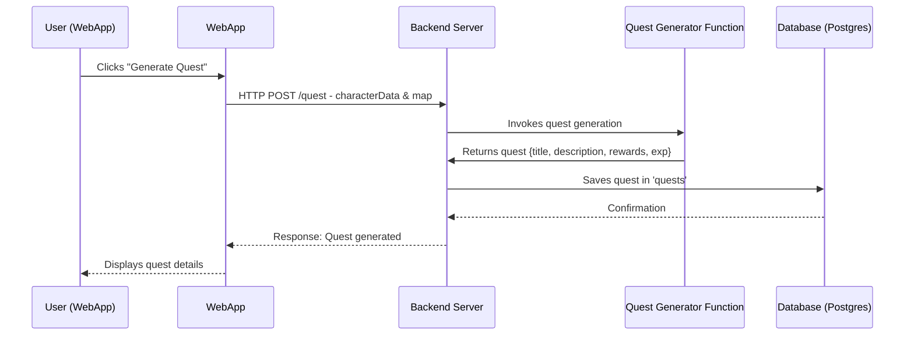

# Quest Generation Process

This document describes the process of generating a quest in our web application.

## Process Flow

1. **User Action**: The user clicks on the "Generate Quest" button in the web application.

2. **Web Application Request**: The web application sends a POST request to the backend server. The request is sent to the /quest endpoint and includes the character data and map as data.

3. **Quest Generation**: The backend server invokes the quest generator function, which generates a new quest based on the provided character data and map.

4. **Quest Data**: The quest generator function returns the generated quest to the server. The quest includes a title, description, rewards, and experience points.

5. **Database Storage**: The server saves the generated quest in the 'quests' table in the PostgreSQL database.

6. **Database Confirmation**: The database sends a confirmation back to the server once the quest has been successfully saved.

7. **Server Response**: The server sends a response back to the web application, indicating that the quest has been generated successfully.

8. **User Confirmation**: The web application displays the details of the generated quest to the user.

## Sequence Diagram

The following sequence diagram illustrates this process:

https://www.mermaidchart.com/app/projects/0b40769f-6378-41ce-9e9d-c3aba7ebea19/diagrams/fe1492fe-3114-40bb-b139-9b92db1d689d/version/v0.1/edit
